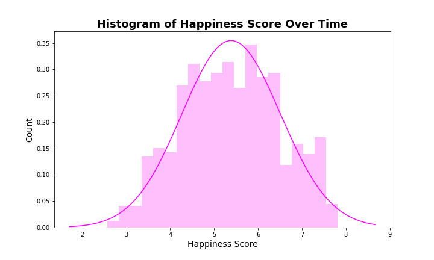

# Happiness Index Investigation

## Background
Find, clean, and analyze data through exploratory data analysis (EDA) investigating the World Happiness Index and determining whether weather affects happiness.

## Technologies Used
- Pandas
- Jupyter Notebook
- Matplotlib
- Seaborn

## Hypotheses
- Happiness has increased over time.
- Weather will affect happiness.
- Predict happiness will decrease next year.

## Data
We used data from Kaggle, the OpenWeather API, and Google Maps API
- Kaggle: https://www.kaggle.com/mathurinache/world-happiness-report
- OpenWeather API: https://openweathermap.org/api
- Google Maps API: https://developers.google.com/maps

### Data Cleaning
Imported data sets for the years 2015-2020. Cleaned data by formatting and renaming columns to create consistency over the time period.  Merged these six dataframes into one CSV which allowed for better comparison and further analysis.

## Data Analysis
__Who is happy?__
The world chloropeth map illustrates the Happiness Scores by country from 2015-2020. Countries with the highest happiness scores are shown in red and countries with the lowest happiness scores are showin in purple.

__Happiness Scores over Time__
After analyzing who was happy, we analyzed the Happiness Score over time. The histogram shows a normal distribution of these scores over the 2015-2020 timeframe highlighted by the overlay. The violin plot of the Happiness Score goes on to emphasize this distribution for each year in addition to showing the slight increase in scores.

