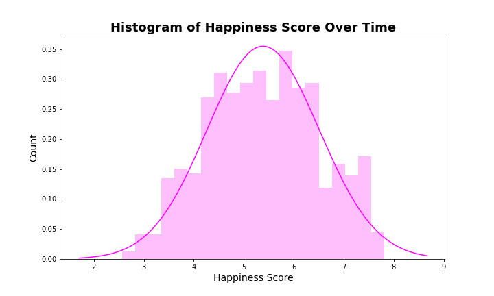
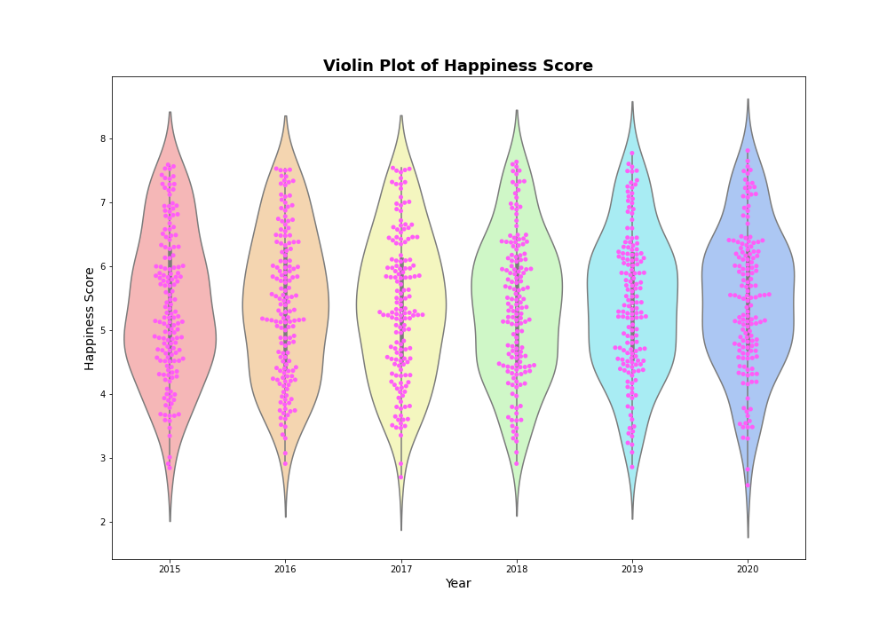

# Happiness Index Investigation

## Background
Find, clean, and analyze data through exploratory data analysis (EDA) investigating the World Happiness Index and determining whether weather affects happiness.

## Technologies Used
- Pandas
- Jupyter Notebook
- Matplotlib
- Seaborn

## Hypotheses
- Happiness has increased over time.
- Weather will affect happiness.
- Predict happiness will decrease next year.

## Data
We used data from Kaggle, the OpenWeather API, and Google Maps API
- Kaggle: https://www.kaggle.com/mathurinache/world-happiness-report
- OpenWeather API: https://openweathermap.org/api
- Google Maps API: https://developers.google.com/maps

### Data Cleaning
Imported data sets for the years 2015-2020. Cleaned data by formatting and renaming columns to create consistency over the time period.  Merged these six dataframes into one CSV which allowed for better comparison and further analysis.

## Data Analysis
__Who is happy?__
The world chloropeth map illustrates the Happiness Scores by country from 2015-2020. Countries with the highest happiness scores are shown in red and countries with the lowest happiness scores are showin in purple.

__Happiness Scores over Time__
After analyzing who was happy, we analyzed the Happiness Score over time. The histogram shows a normal distribution of these scores over the 2015-2020 timeframe highlighted by the overlay. The violin plot of the Happiness Score goes on to emphasize this distribution for each year in addition to showing the slight increase in scores.

__ANOVA: Economy (GDP per Capita)__
After investigating the ANOVA for overall Happiness Score, we ran it with all of the different variables that made up the Happiness Score. All of the variables were statistically significant. It is important to note that for the variable Economy, the statistically significant result was fragile. By looking at the series of means in figure 4, the year 2015 is a very slight outlier compared to the rest of the years. Despite how inconsequential this may appear, we found that after removing this year from the test, there was no longer overall statistical significance for Economy.

__ANOVA: Health Life Expectancy__
Through ANOVA testing we found that another significant factor of overall happiness was the Health Life Expectancy variable. We also tried manipulating the test by removing the year 2017, as it was the outlier for this variable, to see if it would cause the same result as the Economy test. Once it was removed, the data was still statistically significant.

__Top & Bottom Countries__
After investigating the difference between different variables across the years, the countries that were repeatedly in the top and bottom 10% of the total countries based on their Happiness Score were investigated.  The top three countries were Denmark, Norway and Iceland. The bottom three countries were Rwanda, Afghanistan, and Tanzania.

All three of the top countries' Health and Life Expectancy dropped from 2019 to 2020 whereas the bottom three countries have risen from 2019 to 2020. It is also worth noting that these values are quickly approaching each other, yet the bottom three countries remained in the bottom 10% and the top three countries remained in the top 10% based on Happiness Rank.

As the years go on, the top three countries are slowly decreasing whereas the bottom three continue to rise. This analysis of how the top and bottom countries changed over time lead us to dig deeper into our data to see what variable correlated most with Happiness Score.

__T-tests__
T-tests were performed comparing the top 10 countries Happiness Score of 2015 to 2020, and then ran the same test for the bottom 10 countries. When looking at Happiness Score, both tests produced p-values greater than .05. Therefore the changes over time are not statistically significant, and we rejected the alternative hypothesis, accepting the null.

When running the test for Economy and Health, these tests all produced p-values less than .05. Therefore the changes were statistically significant, rejecting the null hypothesis and accepting the alternative. 

__Correlations__
Economy and Health Life Expectancy have the strongest correlations. The strengths of these correlations were also investigated by creating scatterplots and running stats models.  Since both r-values were above .5, they have a strong positive correlation. 

Stats models were also run on the other variables. All of them had a positive r-value that was below .5 and therefore have a weak correlation with Happiness Score.

__Correlations with Weather__
There are not very many strong correlations between any of the weather variables and the World Happiness Report variables. There is a slight positive correlation between Latitude and Happiness Score and a slight negative correlation between Temperature and Happiness Score. 

After reviewing each R-value it became apparent none of the weather variables had a strong correlation with Happiness Score.  There is a weak relationship between Happiness Score and Temperature. The calculated r-values for the simple linregress is 0.44 which shows that there is a weak positive correlation between Happiness Score and Latitude. 

Similarly, the relationship between Happiness Score vs Latitude shows a slight negative correlation. The calculated r-values for the simple linregress is -0.35 which shows that there is a weak negative correlation between Happiness Score and Temperature. 

## Prediction Model
Based on the correlation heat map, a multivariate regression prediction model was used to investigate if multiple weather variables (Latitude, Humidity, Cloudiness) could predict Happiness Score.  The adjusted R-squared value decreased when any other variables were used. 

Overall, our prediction model including weather variables holds a 21% accuracy rating, which indicates that our regression model is not the best. 

It is apparent that the predictions do not cluster around the actual values (pink line) and there is a large discrepancy between the two values. This is also visualized where the residual values do not cluster around the 0 value, further proving that our regression model cannot be validated. 

## Conclusions
Happiness has increased over time, weather does not positively affect happiness, and that the ability to predict happiness is questionable because it is dependent upon the variables.

## Limitations
There were a few limitations that came across in the exploration of this dataset. The dataset was limited because it was trying to quantify a feeling that everyone defines differently. While it may at first seem like the responses to the questions given were prone to subjectivity, we instead believe that the questions asked were. The dataset was also not uniform across all 6 years. Some countries were only reported for one year, and we didn’t use the raw dataset for this reason.

## Future Work
In the future, it would be useful to expand the weather data by accumulating it over the same 2015-2020 time period and see if there really is any correlation between weather and happiness. Investigating other factors such as education, housing, etc. would be beneficial to see if there is any connection between them and Happiness Scores.

